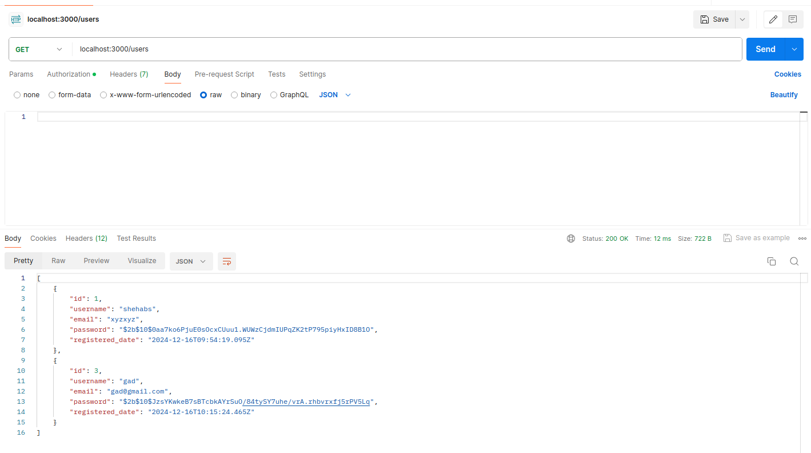

# Library System

A **Library System** built with Docker, providing user and book management, borrowing functionalities, and reports. This document outlines the setup instructions, API routes, and features of the system.

## Table of Contents
1. [Setup Instructions](#setup-instructions)
2. [Users Routes](#users-routes)
3. [Books Routes](#books-routes)
4. [Borrow Routes](#borrow-routes)
5. [Testing](#testing)
6. [Schema Design](#schema-design)
---

## Setup Instructions

1. Run the following command in the project directory to start the Docker containers and initialize the database:
   ```bash
   docker-compose up
   ```
   This will set up all containers, configure the database, and prepare the environment.


---

## Users Routes

### 1. **`POST /users/signup`**
- **Description**: Creates a new user.
- **Request Body**:
  ```json
  {
    "username": "your_username",
    "email": "your_email",
    "password": "your_password"
  }
  ```
- **Response**: Returns a JSON Web Token (JWT) for authorization.
- Ensure JWT is sent in the **Authorization Header** using the `Bearer Token` format for protected routes.
- **Example**:
  

### 2. **`POST /users/login`**
- **Description**: Logs in a user and returns a JWT.
- **Request Body**:
  ```json
  {
    "username": "your_username",
    "password": "your_password"
  }
  ```
- **Response**: Returns a JWT if credentials are valid.
- **Example**:
  

### 3. **`PUT /users`**
- **Description**: Updates user information (password or email).
- **Request Body** (fields to update):
  ```json
  {
    "email": "new_email",
    "password": "new_password"
  }
  ```
- **Response**: Returns the updated user record.
- **Example**:
  

### 4. **`DELETE /users`**
- **Description**: Deletes a user.
- **Response**: Returns the deleted user record.
- **Example**:
  

### 5. **`GET /users`**
- **Description**: Retrieves all users from the database.
- **Response**: Returns a list of users.
- **Example**:
  

---

## Books Routes

### 1. **`POST /books`**
- **Description**: Adds a new book to the system.
- **Request Body**:
  ```json
  {
    "author": "book_author",
    "title": "book_title",
    "isbn": "book_isbn",
    "available_quantity": 10,
    "shelf_location": "A1-B2"
  }
  ```
- **Response**: Returns the created book.
- **Example**:
  

### 2. **`PUT /books/:book_id`**
- **Description**: Updates specified fields of a book.
- **Request Body** (fields to update):
  ```json
  {
    "available_quantity": 5
  }
  ```
- **Response**: Returns the updated book record.
- **Example**:
  

### 3. **`DELETE /books/:book_id`**
- **Description**: Deletes a book by its ID.
- **Response**: Returns the deleted book record.
- **Example**:
  

### 4. **`GET /books`**
- **Description**: Retrieves all books in the database.
- **Response**: Returns a list of books.
- **Example**:
  

### 5. **`GET /books/search`**
- **Description**: Searches for books based on query parameters.
- **Query Parameters**:
  - `title`: Search by title.
  - `author`: Search by author.
  - `isbn`: Search by ISBN.
- **Behavior**: Performs an `AND` operation when multiple fields are provided.
- **Example**:
  
  

---

## Borrow Routes

### 1. **`POST /borrow`**
- **Description**: Allows a user to borrow a book.
- **Request Body**:
  ```json
  {
    "book_id": "book_id",
    "days": 7
  }
  ```
- **Response**: Returns the created borrow record.
- **Example**:
  

### 2. **`POST /borrow/return/:book_id`**
- **Description**: Allows a user to return a borrowed book.
- **Response**: Returns success or error messages.
- **Example**:
  

### 3. **`GET /borrow`**
- **Description**: Retrieves all borrow records.
- **Example**:
  

### 4. **`GET /borrow/borrowed_books`**
- **Description**: Retrieves all books borrowed by the user (based on the JWT).
- **Example**:
  

### 5. **`GET /borrow/overdue`**
- **Description**: Retrieves all overdue borrowed books.
- **Example**:
  

### 6. **`GET /borrow/borrowing_processes`**
- **Description**: Retrieves all borrowing processes within a specific date range.
- **Query Parameters**:
  - `from`: Start date.
  - `to`: End date.
- **Response**: Returns data in CSV format.
- **Example**:
  

### 7. **`GET /borrow/borrowing_processes/last_month`**
- **Description**: Retrieves all borrowing processes from the last month.
- **Response**: Returns data in CSV format.
- **Example**:
  

### 8. **`GET /borrow/overdue_processes/last_month`**
- **Description**: Retrieves overdue processes for books borrowed in the last month.
- **Response**: Returns data in CSV format.
- **Example**:
  

---

## Testing

To run tests, follow these steps:
1. Enter the backend container:
   ```bash
   docker exec -it <backend-container-name> /bin/bash
   ```
2. Run the test command:
   ```bash
   npm run test
   ```

---

## Notes
- Ensure JWT is sent in the **Authorization Header** using the `Bearer Token` format for protected routes.

---

## Schema Design

